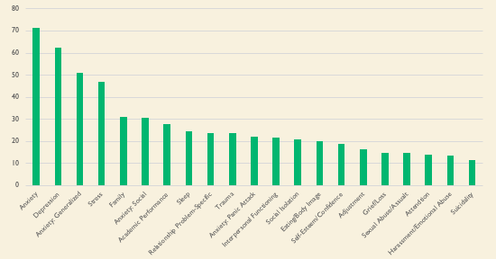
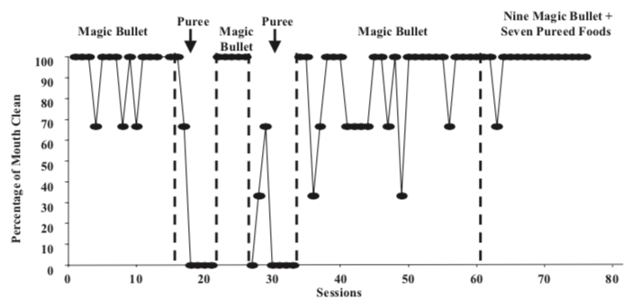

```{r setup, include=FALSE}
knitr::opts_chunk$set(echo = FALSE)
```

## University of Oregon Student Mental Health Data



(UCC Initial Assessment Fall 2017-Winter 2018)

## An Evaluation of Texture Manipulations to Increase Swallowing


(Kadey, Piazza, Rivas, & Zeleny, 2013)

