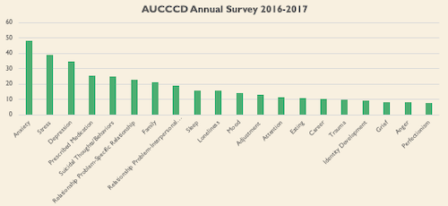
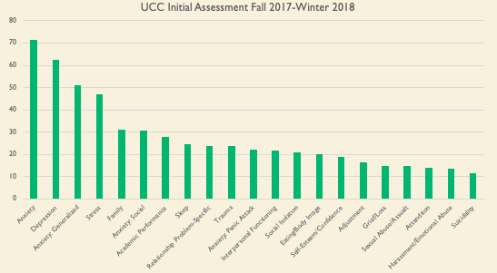

```{r setup, include=FALSE}
knitr::opts_chunk$set(echo = FALSE)
```

## Student Mental Health Data




## An Evaluation of Texture Manipulations to Increase Swallowing


(Kadey, Piazza, Rivas, & Zeleny, 2013)

